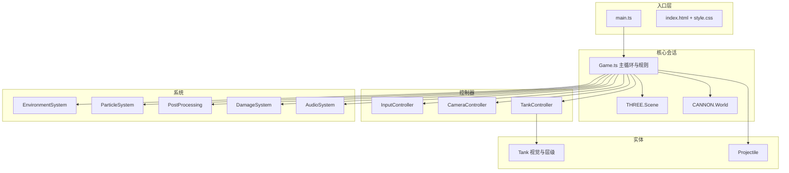

# 二战坦克大战 — 架构设计文档

> 本文档描述当前代码库的分层结构、运行时行为与扩展点，供持续迭代时对齐设计决策。  
> **维护约定**：变更架构（新增子系统、改变主循环顺序、物理策略）时，请同步更新本节与下方「修订记录」。

---

## 1. 文档目的

- 为新成员或未来的自己提供**一张地图**：入口、依赖关系、数据流。
- 标出**稳定边界**（如 `Game`  orchestration、`TankController` 街机物理）与**易变区域**（HUD DOM、数值平衡）。
- 列出**已知约束与技术债**，避免重复踩坑。

---

## 2. 技术栈

| 层级 | 技术 | 说明 |
|------|------|------|
| 运行时 | 浏览器 / ES Module | 无服务端，纯前端 |
| 构建 | Vite 5 + TypeScript 5 | `npm run build` = `tsc -b && vite build` |
| 渲染 | Three.js ~0.160 | `WebGLRenderer`、`Scene`、后期处理 |
| 物理 | cannon-es ~0.20 | 世界步进、刚体、射线、**与街机速度模型的折中**（见 §6） |
| UI | HTML + Tailwind + 自定义 CSS | 选车/战场菜单与 HUD 大量由 `index.html` + `style.css` 驱动 |
| 移动端 | nipplejs | 虚拟摇杆 → `InputController.setVirtualDrive` |

---

## 3. 总体架构

采用 **单页应用 + 单例游戏会话**：菜单由 `main.ts` 管理，进入战斗后构造 `Game` 并启动渲染循环。



**依赖方向（应遵守）**：

- `data/*`：无游戏逻辑，仅数据。
- `entities/*`：Three.js 物体与表现，不直接依赖 `Game.ts`。
- `controllers/*`：输入、相机、载具控制，可依赖 `entities` 与 `systems` 类型。
- `systems/*`：环境、粒子、伤害等，尽量不依赖 `Game` 类本身（通过注入或回调更佳）。
- `Game.ts`：唯一「编排中心」，可依赖上述全部。

---

## 4. 目录结构（源码）

```
src/
├── main.ts                 # 选车/战场/天气/模式 UI，localStorage，创建 Game
├── style.css               # 全局 + HUD + 选单样式
├── data/
│   └── tanks.ts            # 坦克定义、弹药表、国家枚举
└── game/
    ├── Game.ts             # 主循环、关卡逻辑、AI、HUD 绑定
    ├── GamePresets.ts      # 会话配置、模式与 UI 文案预设
    ├── core/
    │   └── InputController.ts
    ├── controllers/
    │   ├── CameraController.ts
    │   └── TankController.ts
    ├── entities/
    │   ├── Tank.ts
    │   └── Projectile.ts
    ├── graphics/
    │   ├── CamouflageGenerator.ts
    │   └── TankVisualFactory.ts
    ├── loaders/
    │   └── ModelLoader.ts
    ├── mobile/
    │   └── MobileControls.ts
    └── systems/
        ├── AudioSystem.ts
        ├── BattlefieldLayouts.ts   # 地图几何、出生点、天气数值等
        ├── BattlefieldTypes.ts
        ├── DamageSystem.ts
        ├── EnvironmentSystem.ts
        ├── ParticleSystem.ts
        └── PostProcessing.ts
```

`public/models/tanks/`：可选外部 GLB，缺失时回退程序几何 + 程序贴图。

---

## 5. 主循环与帧序（关键）

每一帧（`Game.animate`）在「战斗进行中」大致顺序为：

1. **输入**：`updatePlayer` / `updateEnemyAi` → 内部调用 `TankController.update`（驾驶、炮塔、动画参数）。
2. **物理步进**：`world.step(1/60, delta, 3)`。
3. **街机+物理融合修正**：`TankController.applyDriveVelocityAfterPhysics(delta)`  
   - 无碰撞时：保持街机速度手感；  
   - 碰撞时：尊重物理求解阻挡结果并降速；  
   - 兜底：前向射线阻挡，防止高速度薄墙穿透。
4. **视觉同步**：`syncVisuals()` 将刚体位姿同步到 `Tank.root`。
5. **补给拾取**：`updateSupplyPickups(delta)`（旋转/浮动补给箱 + 半径拾取）。
6. **弹体、瞄准预测、相机、环境、伤害、粒子、HUD** 等更新。
7. **后期处理渲染**：`postProcessing.render(delta)`。

> **改进时注意**：当前仍是「街机速度模型 + 物理接触修正」混合策略。若将来升级为完全物理载具（如 `RaycastVehicle`），需整体替换这一路径并重新校准 HUD 速度来源。

---

## 6. 载具模型：街机 + Cannon

### 6.1 刚体

- 每辆坦克一个 **`CANNON.Box`**，与 `TankProfile.collisionHalfExtents` 对齐。
- 使用专用 **`CANNON.Material`（如 tankHull）** 与 `ContactMaterial` 配置坦克–地面、坦克–坦克摩擦，避免默认高摩擦与手写速度对抗。
- `linearDamping` 保持较低；减速主要由 `TankController` 内逻辑完成。

### 6.2 运动学变量

- **前进/倒车**：`forwardSpeed` 向目标速度阻尼（`MathUtils.damp`），目标由油门、地形、`maxForwardSpeed` 等推导。
- **转向**：`turnVelocity` 与车体 yaw 更新；履带动画、车体俯仰侧倾等由 `Tank.updateAnimation` 消费。
- **炮塔/炮管**：`turretYaw`、`gunPitch`，与鼠标或 AI 瞄准关联。

### 6.3 显示速度

- HUD 等建议使用 **`getArcadeSpeedMetersPerSecond()`**（`|forwardSpeed|`）换算 km/h，与街机模型一致；`getNormalizedSpeed()` 亦基于该值。

### 6.4 防穿透策略（当前实现）

- 世界求解器使用更高迭代与更强接触方程参数（`Game` 初始化时配置）。
- `applyDriveVelocityAfterPhysics` 不再“无条件覆盖”X/Z：
  - 先比较求解结果与街机期望位移；
  - 若检测到碰撞修正，保留求解位置并衰减前向速度；
  - 若未碰撞，保持街机位移手感。
- 额外前向 `raycastClosest` 作为兜底阻挡，降低高速薄障碍穿透概率。

---

## 7. 渲染与资源管线

| 环节 | 说明 |
|------|------|
| 程序坦克 | `TankVisualFactory` 按 `tank id` 组装箱体/圆柱；`CamouflageGenerator` 生成 PBR 贴图 |
| 外部模型 | `ModelLoader` 加载 GLB，按包围盒缩放到 profile，节点名匹配车体/炮塔/炮管 |
| 坦克实体 | `Tank` 挂载 `root` / `turretPivot` / `gunPivot` / `muzzleAnchor` / 相机锚点等 |
| 环境 | `EnvironmentSystem`：地形高度、雾、天光、植被、建筑刚体等 |
| 后期 | `PostProcessing`：Bloom、景深、FXAA 等，随相机模式调整 |

---

## 8. 战场与模式

- **地图数据**：`BattlefieldLayouts.ts` — `playerSpawn`、`enemySpawns`、结构物、地形影响区、`supplyPoints`。
- **敌方出生点**：可通过 `pullEnemyTowardPlayer` 将敌方向玩家出生拉拢，控制开局距离。
- **模式**：经典 / 生存 / 歼灭等，在 `Game.setupMission` 与 `updateMission` 中分支。
- **难度**：`GamePresets.ts` 中 `DIFFICULTY_PRESETS`（简单/中级/高级）影响敌方数量、血量、伤害、精度、开火节奏与交战距离。
- **会话配置**：`GameSessionConfig`（`GamePresets.ts`）— 坦克 id、战场 id、天气 id、模式 id、难度 id、标签配置。

---

## 9. 战斗与伤害

- **炮弹**：`Projectile` 使用射线检测（`world.raycastClosest`），非全刚体弹体。
- **伤害**：`DamageSystem` — 入射角、装甲、跳弹、模块伤害（履带/炮/引擎/弹药架）。`resolveHit` 支持可选 `damageMultiplier`：敌方命中玩家时由 `Game` 注入难度倍率与玩家减伤。
- **事件反馈**：粒子、音效、屏幕震动、浮动文字、击杀播报等由 `Game` 协调。

### 9.1 弹药、补给与奖励（`Game` 编排）

- **标准弹**：数据来自 `data/tanks.ts` 中 `getAmmoDefinition(gunCaliber)`，无“备弹数量”概念，仅受 `TankController` 装填冷却限制。
- **特殊弹**：`playerBuffs.apShots`（穿甲弹+）、`playerBuffs.heShots`（高爆弹）。战场内由 `InputController` 的 `Digit1/2/3` 选择弹种，`Game.getAmmoPackage` 根据选择与库存生成 `Projectile` 参数；库存为 0 时回退标准弹。
- **开局库存**：`Game.ts` 中 `STARTING_AP_SHOTS` / `STARTING_HE_SHOTS` 在会话创建后写入 `playerBuffs`。
- **地图补给**：`BattlefieldLayouts` 每条地图定义 `supplyPoints`（`x/z/kind`）→ `EnvironmentSystem.getBattlefieldState()` 透传 → `Game.spawnSupplyCrates` 生成场景补给箱 → `updateSupplyPickups` 做距离拾取与资源发放（含维修类补给）。
- **击杀奖励**：`grantRandomReward` 在击毁敌方后随机发放治疗、机动、装填 buff 或特殊弹药；特殊弹药采用 `+=` 叠加，避免互相清零。

---

## 10. 输入与相机

- **键盘/指针**：`InputController` — WASD、指针锁定、鼠标增量用于瞄准；战场内 `Digit1/2/3` 切换弹种；`KeyX` 手刹；右键按住瞄准镜缩放（由 `Game.updatePlayer` 调 FOV）。
- **相机**：`CameraController` — POV / 第三人称 / 俯视；俯视建议用世界坐标算相机位姿，避免与车体俯仰耦合导致异常旋转。
- **移动端**：`MobileControls` + nipplejs。

---

## 11. 扩展点（建议）

| 方向 | 建议接入点 |
|------|------------|
| 新坦克 | `data/tanks.ts` + `TankVisualFactory.buildTankVisual` 或仅数据 + 外部 GLB |
| 新地图 | `BattlefieldLayouts` 新增 `BattlefieldDefinition`，`EnvironmentSystem` 消费 |
| 网络对战 | 需同步状态机：建议抽象「输入快照 + 确定性步进」或服务端权威；当前架构为纯本地 |
| 物理升级 | 替换 `TankController` 速度积分策略与 `applyDriveVelocityAfterPhysics` |
| 性能 | 实例化渲染、合并网格、降低后期 passes、LOD |

---

## 12. 已知约束与技术债（滚动更新）

- **物理与街机双轨**：当前依赖步进后位移修正；改动 `world.step` 或载具控制时需回归测试车速与位移一致性。
- **HUD 与 DOM**：`Game` 内大量 `document.querySelector`，元素缺失时需防空；不利于单元测试，长期可抽象为 UI 适配层。
- **资源路径**：外部模型未放置时控制台可能报错，应不影响程序几何回退。
- **README 与实现**：根目录 `README.md` 若与实现不一致，以代码与本文档为准，或同步修订 README。

---

## 13. 修订记录

| 日期 | 摘要 |
|------|------|
| 2026-04-05 | 初版：架构分层、主循环、街机+Cannon 载具策略、扩展点与约束 |
| 2026-04-06 | 补充：防穿透与射线兜底、难度/会话配置、弹药与补给点、主循环补给拾取、伤害倍率与文档对齐 |

---

## 14. 相关文件

- 根目录 `README.md`：功能列表与启动说明  
- `public/models/tanks/README.md`：GLB 命名与路径约定  
